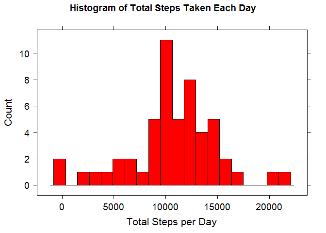
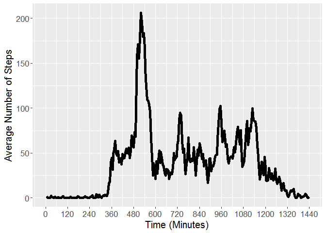
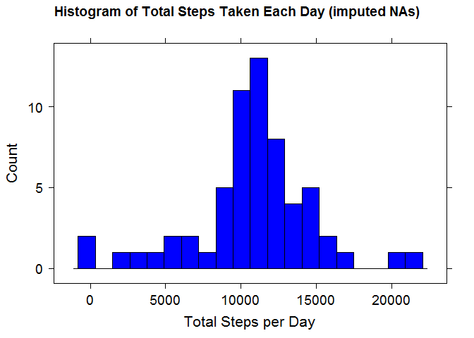
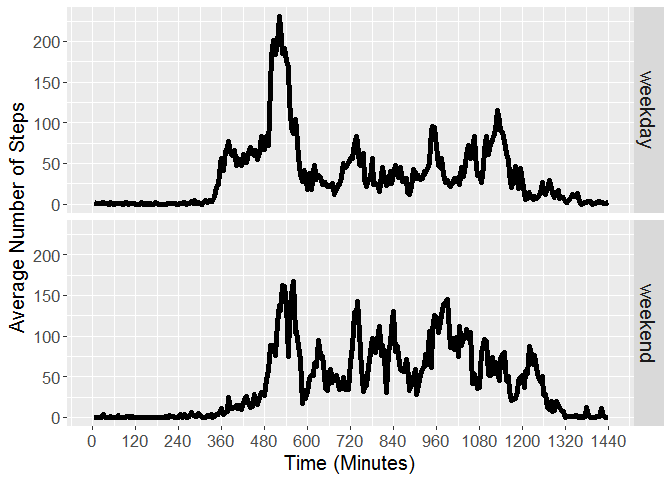

In this document, analysis is performed on a data set obtained from a personal activity monitoring device. The device collected data at 5-minute intervals throughout the day during the months of October and November, 2012.  
Specifically, the data is made up of three columns:  

- **steps**: Number of steps taken during a 5-minute interval; Note that missing values are denoted as **NA**  
- **date**: The date on which the measurement was take; format is YYYY-MM-DD  
- **interval**: Numeric identifier for the 5-minute interval in which the data was taken  

The compressed dataset is available from the following URL:  

- https://d396qusza40orc.cloudfront.net/repdata%2Fdata%2Factivity.zip  

The following code is required for loading the data as well as all analysis presented here:  

```r
fileDownload <- function() {
    # This function checks whether the desired data is downloaded. If not,
    # it is downloaded and extracted.
    if(!file.exists("data")) {dir.create("data")}
    fileURL <- "https://d396qusza40orc.cloudfront.net/repdata%2Fdata%2Factivity.zip"
    zipFile <- "./data/activity.zip"
    path <- sub(".zip", "", zipFile)
    download.file(fileURL, destfile = zipFile)
    unzip(zipFile, exdir = path)
}

library(dplyr)
library(lattice)
library(ggplot2)
```

## Loading and preprocessing the data

The following code will download, load, and process the data for use in this analysis:


```r
fileDownload()
data <- read.csv('./data/activity/activity.csv',
    colClasses = c("integer", "Date", "integer"))
data <- data %>% mutate(interval = rep(1:288, 61), minutes = interval * 5)
summary(data)
```

```
##      steps             date               interval         minutes      
##  Min.   :  0.00   Min.   :2012-10-01   Min.   :  1.00   Min.   :   5.0  
##  1st Qu.:  0.00   1st Qu.:2012-10-16   1st Qu.: 72.75   1st Qu.: 363.8  
##  Median :  0.00   Median :2012-10-31   Median :144.50   Median : 722.5  
##  Mean   : 37.38   Mean   :2012-10-31   Mean   :144.50   Mean   : 722.5  
##  3rd Qu.: 12.00   3rd Qu.:2012-11-15   3rd Qu.:216.25   3rd Qu.:1081.2  
##  Max.   :806.00   Max.   :2012-11-30   Max.   :288.00   Max.   :1440.0  
##  NA's   :2304
```

In the previous code, the following modifications were made to the data:  

- The numeric identifier for each 5-minute interval is replaced with consecutive numbering of 1 through 288, which represents the 288 total 5-minute increments in a 24-hour day.  
- The column "minutes" is added, which is equal to the numeric interval multiplied by 5. This represents the time of day for each measurement from 0 to 1440 minutes.  

## What is mean total number of steps taken per day?

### Calculate the total number of steps taken per day:


```r
data.sum <- data %>% select(date, steps) %>% group_by(date) %>%
    summarize(steps = sum(steps))
str(data.sum)
```

```
## Classes 'tbl_df', 'tbl' and 'data.frame':	61 obs. of  2 variables:
##  $ date : Date, format: "2012-10-01" "2012-10-02" ...
##  $ steps: int  NA 126 11352 12116 13294 15420 11015 NA 12811 9900 ...
```

Using the *dplyr* package, the previous code groups the data by date and computes the total number of steps for each day. As can be seen from the *str(data)* function, the new data frame, *data.sum*, has 61 rows (one for each date) along with the totalled steps. For this portion of the analysis, there are 8 days in the data set that do not have measurements, and thus are *NAs*. This can be seen here:  


```r
summary(data.sum)
```

```
##       date                steps      
##  Min.   :2012-10-01   Min.   :   41  
##  1st Qu.:2012-10-16   1st Qu.: 8841  
##  Median :2012-10-31   Median :10765  
##  Mean   :2012-10-31   Mean   :10766  
##  3rd Qu.:2012-11-15   3rd Qu.:13294  
##  Max.   :2012-11-30   Max.   :21194  
##                       NA's   :8
```

### Make a histogram of the total number of steps taken each day:


```r
with(data.sum, histogram(~ steps, type = "count", nint = 20,
    xlab = list(label = "Total Steps per Day", fontsize = 16),
    ylab = list(fontsize = 16),
    main = "Histogram of Total Steps Taken Each Day",
    col = "red", scales = list(cex = 1.2)))
```

<!-- -->

In the histogram above, it is evident that for the majority of days, the total number of steps is between approximately 9000 and 15000.  

### Calculate and report the mean and median of the total number of steps taken per day:


```r
paste("Mean of Total Steps per Day = ", mean(data.sum$steps, na.rm = TRUE))
```

```
## [1] "Mean of Total Steps per Day =  10766.1886792453"
```

```r
paste("Median of TotalSteps per Day = ", median(data.sum$steps, na.rm = TRUE))
```

```
## [1] "Median of TotalSteps per Day =  10765"
```

## What is the average daily activity pattern?

### Make a time series plot of the 5-minute interval and the average number of steps taken, averaged across all days:


```r
data.daily <- data %>% select(interval, steps, minutes) %>% group_by(interval) %>%
    summarize(steps = mean(steps, na.rm = TRUE), minutes = minutes[1])
str(data.daily)
```

```
## Classes 'tbl_df', 'tbl' and 'data.frame':	288 obs. of  3 variables:
##  $ interval: int  1 2 3 4 5 6 7 8 9 10 ...
##  $ steps   : num  1.717 0.3396 0.1321 0.1509 0.0755 ...
##  $ minutes : num  5 10 15 20 25 30 35 40 45 50 ...
```

The previous code uses the *dplry* package in order to group the data by 5-minute interval and computes the average number of steps per 5-minute interval across all days. For this computation, the missing measurements, denoted as *NAs*, are omitted.


```r
ggplot(data.daily, aes(minutes, steps)) + geom_line(size = 2) +
    coord_cartesian(xlim = c(0, 1440)) +
    scale_x_continuous(breaks = seq(0, 1440, by = 120)) +
    labs(x = "Time (Minutes)", y = "Average Number of Steps") +
    theme(axis.text = element_text(size = 13), axis.title = element_text(size = 15))
```

<!-- -->

In the time-series plot above, you can see that the average number of steps is near-zero before 360 minutes and after 1320 minutes, which corresponds to a typical sleep pattern because those times are between 10PM and 6AM. For the rest of the minutes in the day, there are peaks and valleys, but most of the time intervals average at least 25 steps.  

### Which 5-minute interval, on average across all the days in the dataset, contains the maximum number of steps?


```r
maxSteps <- max(data.daily$steps)
maxInterval <- with(data.daily, interval[steps == maxSteps])
maxMinutes <- with(data.daily, minutes[steps == maxSteps]) / 60
hours <- floor(maxMinutes)
minutes <- (maxMinutes - hours) * 60
paste("5-minute Time Interval for the Most Average Steps =", maxInterval,
      "out of 288")
```

```
## [1] "5-minute Time Interval for the Most Average Steps = 104 out of 288"
```

```r
paste("Actual Times for the Most Average Steps =",
      paste(hours, minutes - 5, sep = ":"), "to",
      paste(hours, minutes, sep = ":"))
```

```
## [1] "Actual Times for the Most Average Steps = 8:35 to 8:40"
```

From the previous code, it is shown that the 5-minute time interval with the most number of steps is interval number 104, which corresponds to between 8:35 and 8:40 in the morning.  

## Imputing missing values

### Calculate and report the total number of missing values in the dataset:


```r
paste("Total Number of Entries that are NAs =", sum(is.na(data$steps)))
```

```
## [1] "Total Number of Entries that are NAs = 2304"
```

In the data set being used here, there are 2304 missing measurements, which corresponds to 8 total days since there are 288 5-minute intervals in a 24-hour day.  

### Devise a strategy for filling in all of the missing values in the dataset. Create a new dataset that is equal to the original dataset but with the missing data filled in:

For these 2304 missing measurements, I chose to approximate them as the average number of steps across all days for each one's respective 5-minute interval. This strategy is achieved through the following code:  


```r
imputedNAs <- data %>% group_by(interval) %>%
    mutate(perInterval = mean(steps, na.rm = TRUE))
imputedNAs$steps <- with(imputedNAs, replace(steps, is.na(steps),
    perInterval[is.na(steps)]))
summary(data$steps)
```

```
##    Min. 1st Qu.  Median    Mean 3rd Qu.    Max.    NA's 
##    0.00    0.00    0.00   37.38   12.00  806.00    2304
```

```r
summary(imputedNAs$steps)
```

```
##    Min. 1st Qu.  Median    Mean 3rd Qu.    Max. 
##    0.00    0.00    0.00   37.38   27.00  806.00
```

In the code above, a new column is added to the original data set using the *dplyr* package which is equal to the average number of steps in each 5-minute interval. These average are then used to replace the missing values in the *steps* column. The summary of the *original steps* values and the new *imputed steps* values indicates that the previous 2304 *NAs* are no longer present.  

### Make a histogram of the total number of steps taken each day:


```r
imputedNAs.sum <- imputedNAs %>% ungroup() %>% select(date, steps) %>%
    group_by(date) %>% summarize(steps = sum(steps))
str(imputedNAs.sum)
```

```
## Classes 'tbl_df', 'tbl' and 'data.frame':	61 obs. of  2 variables:
##  $ date : Date, format: "2012-10-01" "2012-10-02" ...
##  $ steps: num  10766 126 11352 12116 13294 ...
```

The previous code uses the *dplyr* package to group the new data frame, *imputedNAs*, by date and compute the total number of steps per day.  


```r
with(imputedNAs.sum, histogram(~ steps, type = "count", nint = 20,
    xlab = list(label = "Total Steps per Day", fontsize = 16),
    ylab = list(fontsize = 16),
    main = "Histogram of Total Steps Taken Each Day (imputed NAs)",
    col = "blue", scales = list(cex = 1.2)))
```

<!-- -->

In the histogram above, it is evident that approximating the missing values in the manner performed here results in a histogram very similar to the histogram presented previously with the majority number of steps in a day being between approximately 9000 and 15000.  

### Calculate and report the **mean** and **median** total number of steps taken per day. What is the impact of imputing mising data on the estimates of the total daily number of steps?


```r
paste("Mean of Total Steps per Day with Imputed NAs = ",
    mean(imputedNAs.sum$steps))
```

```
## [1] "Mean of Total Steps per Day with Imputed NAs =  10766.1886792453"
```

```r
paste("Median of TotalSteps per Day with Imputed NAs = ",
    median(imputedNAs.sum$steps))
```

```
## [1] "Median of TotalSteps per Day with Imputed NAs =  10766.1886792453"
```

From the previous code, it is shown that replacing the missing values did not alter the *mean* number of steps per day. However, the *median* number of steps increased slightly and is now equal to the *mean*. This change is logical because each of 8 days that were previously *NAs* are now equal to the *mean* number of steps, which corresponds to the *median* of the data set.  

## Are there differences in activity patterns between weekdays and weekends?

### Create a new factor variable in the dataset with two levels, *weekday* and *weekend*:


```r
imputedNAs$day <- weekdays(imputedNAs$date)
imputedNAs$day[imputedNAs$day %in% c("Saturday", "Sunday")] <- "weekend"
imputedNAs$day[imputedNAs$day != "weekend"] <- "weekday"
imputedNAs$day <- as.factor(imputedNAs$day)
data.day <- imputedNAs %>% select(day, interval, steps, minutes) %>%
    group_by(day, interval) %>%
    summarize(steps = mean(steps), minutes = minutes[1])
str(data.day)
```

```
## Classes 'grouped_df', 'tbl_df', 'tbl' and 'data.frame':	576 obs. of  4 variables:
##  $ day     : Factor w/ 2 levels "weekday","weekend": 1 1 1 1 1 1 1 1 1 1 ...
##  $ interval: int  1 2 3 4 5 6 7 8 9 10 ...
##  $ steps   : num  2.251 0.445 0.173 0.198 0.099 ...
##  $ minutes : num  5 10 15 20 25 30 35 40 45 50 ...
##  - attr(*, "vars")= chr "day"
##  - attr(*, "drop")= logi TRUE
```

In the previous code, a new column, *day*, is added to the *imputedNAs* data frame by applying the *weekdays()* function to the *date* column. From this, the days of the week are converted to either *weekday* or *weekend*, and the *dplyr* package is used to group the data by *day* and *interval* and generates a new data frame, *data.day* that represents the average number of steps for each 5-minute interval across all weekdays and weekends, respectively. The function *str(data.day)* shows the structure of the new data frame and indicates the *day* column as a factor variable with 2 levels, *weekday* and *weekend*.  

### Make a panel plot containing a time series plot of the 5-minute interval and the average number of steps taken, averaged across all weekday or weekend days:


```r
ggplot(data.day, aes(minutes, steps)) + facet_grid(facets = day ~ .) +
    geom_line(size = 2) + coord_cartesian(xlim = c(0, 1440)) +
    scale_x_continuous(breaks = seq(0, 1440, by = 120)) +
    labs(x = "Time (Minutes)", y = "Average Number of Steps") +
    theme(axis.text = element_text(size = 13),
        axis.title = element_text(size = 15),
        strip.text = element_text(size = 15))
```

<!-- -->

The time-series plot above shows that the general structure of the average number of steps is the same for weekdays and weekend, but a few differences are notable. First, the number of steps begins to increase later on weekends than on weekdays, approximately 8AM and 6AM, respectively. Second, despite the initial peak in weekdays between 8AM and 10AM (480 and 600 minutes), the activity throughout the day on weekdays is lower than on weekends.  
